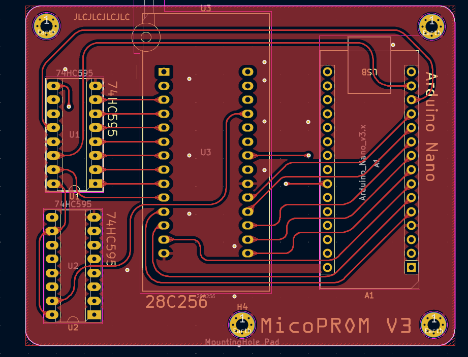
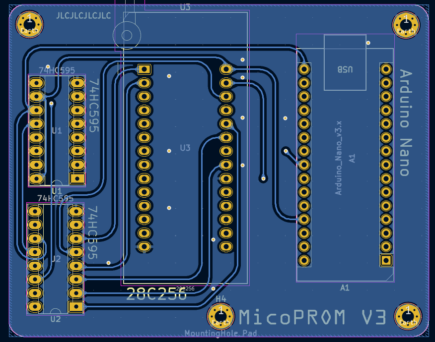
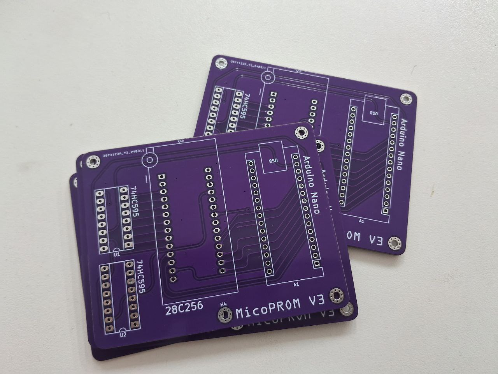
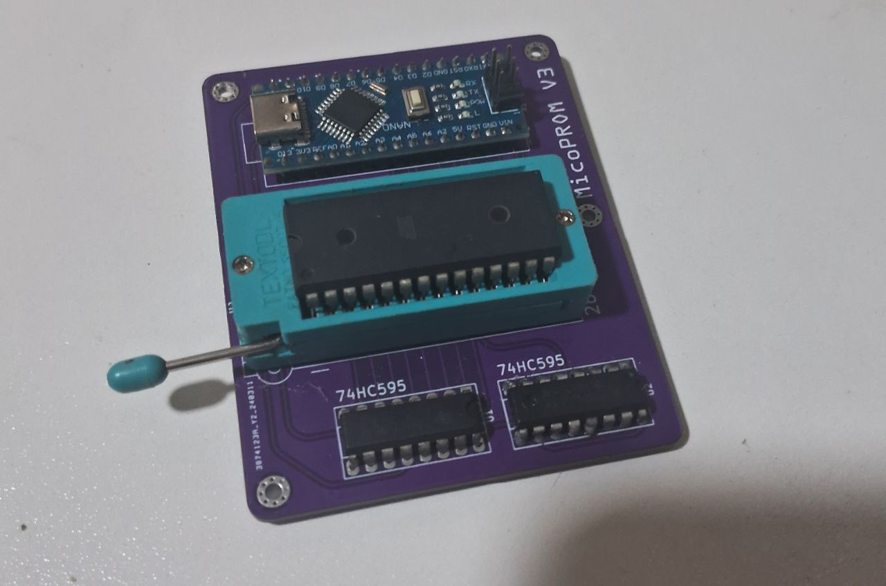

# MicoPROM (V3)
This is a simple 28C256 EEPROM programmer PCB I made and manufactured in 2024 via JLCPCB.

Sadly the original KiCAD files were lost, only the gerber is available, although it's ready for manufacture.

## Hardware
The used components are:
- 1x Arduino Nano
- 2x 74HC595 shift register
- 1x 28-pin DIP ZIF socket
  
The whole PCB was rounded by hand as an aesthetic choice.

## Software
This programmer runs a modified version of the [TommyPROM](https://github.com/TomNisbet/TommyPROM) firmware, to use 74xx595 shift registers instead of 74x164 ones.

## Pictures

